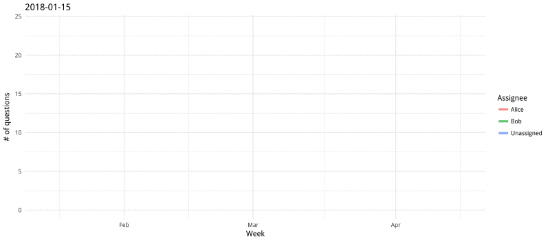
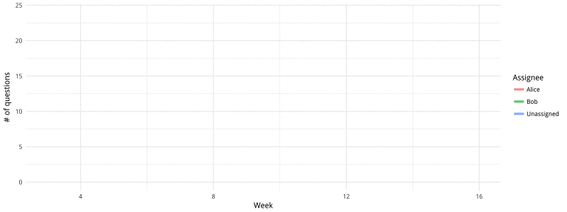
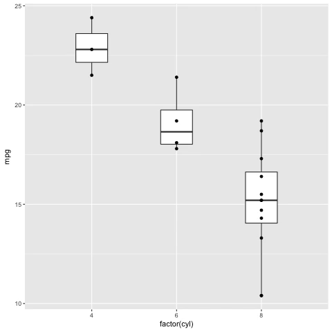
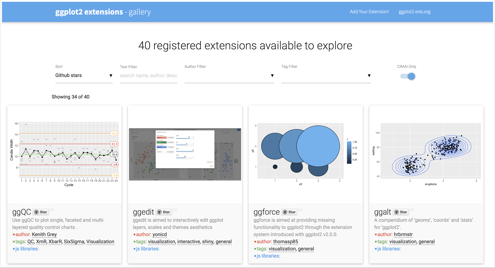

```{r setup, include=FALSE}
options(htmltools.dir.version = FALSE)
options(servr.daemon = TRUE)
```

class: middle, centered

# Three more 🥄🥄🥄 of ggplot2
### Post Processing, extensions and internals
<br /> 
<br />

#### Geneve R User Meetup &mdash; April 26th 2018
#### Xavier Adam (twitter: [@xvrdm](http://twitter.com/xvrdm/))
  

---
class: middle
# Menu du jour

### 1. ggplot2 **post-processing**
--

### 2. ggplot2 **extensions**
--

### 3. ggplot2 **surgery**

---
class: inverse, center, middle

# Post-processing charts in R

---

### Polishing ggplot2 charts

[ROpenSci](https://twitter.com/rOpenSci)'s [`magick` package](https://github.com/ropensci/magick) is your little photoshop inside R. It lets you use the underlying [ImageMagick](https://www.imagemagick.org/script/index.php) graphics library. 

- [Github source for `magick`](https://github.com/ropensci/magick)
- [Vignette with lots of examples](https://cran.r-project.org/web/packages/magick/vignettes/intro.html)

Install with: 

```{r eval=FALSE}
install.packages("magick")

# If you get some errors check github page for info on
# potentially missing dependencies
```

---

We will work on a simple chart with a basic dataset.

```{r message=FALSE, warning=FALSE}
library(ggplot2)
library(magrittr)
library(dplyr)

data <- readRDS("questions_per_week.Rds")
data

```

---

Basic line chart skeleton with `ggplot2`.

```{r fig.width=8, fig.height=4, dev='svg'}
data %>%
  ggplot(aes(x=Week, y=`# of questions`)) +
  geom_line(stat="identity", aes(color=Assignee), alpha = 0.7, size=1.5) +
  labs(title="Number of questions per week") +
  theme_minimal() 
```

---

Adding support for Google Fonts, thanks to [Yixuan Qiu](https://statr.me)'s [`showtext`](https://github.com/yixuan/showtext) package.

```{r fig.height=3.5, fig.width=8, message=FALSE, warning=FALSE, dev='svg'}
library(showtext) #<<
font_add_google("Rubik", "Rubik") #<<
showtext_auto() #<<

data %>%
  ggplot(aes(x=Week, y=`# of questions`)) +
  geom_line(stat="identity", aes(color=Assignee), alpha = 0.7, size=1.5) +
  labs(title="Number of questions per week") +
  theme_minimal() +
  theme(text = element_text(family = "Rubik")) #<<
```

---

Save the chart in a `.png` file with `ggplot2::ggsave()`.

```{r message=FALSE, warning=FALSE}
library(showtext) 
font_add_google("Rubik", "Rubik") 
showtext_auto() 

# Here we assign the chart to a `lchart` variable 
# at the end of the pipeline instead of printing it
# Note that we did not add a title...
data %>%
  ggplot(aes(x=Week, y=`# of questions`)) +
  geom_line(stat="identity", aes(color=Assignee), alpha = 0.7, size=2) +
  theme_minimal() +
  theme(text = element_text(family = "Rubik")) -> lchart 
```

--

```{r}
# Then we save it, as a png.
ggsave(lchart, filename="chart.png", width = 8, height = 3) 
```

Now we have `chart.png` in our computer, ready to be modified.

---

Adding 6-pixels-thick horizontal borders to a chart with `magick::image_border()`.

```{r message=FALSE, warning=FALSE}
library(magick) 
# Reopen the image and assign it to variable `chart`
chart <- image_read("chart.png")
# Save the height in pixel of the image
height <- image_data(chart) %>% attributes() %>% .$dim %>% .[[3]]
# Adding top and bottom grey borders
chart %>% image_border("lightgrey", "0x6") 
```

---

Make a more complex margin: 50px + 6px + 170px. Then crop the bottom margin. I haven't found a way yet to not create the bottom margin, the `magick::image_border()` seems to only work symetrically

```{r message=FALSE, warning=FALSE}
(chart_w_margins <- chart %>% 
  image_border("white", "0x50") %>% 
  image_border("lightgrey", "0x6") %>%
  image_border("white", "0x170") %>%
  # Crop the bottom margins
  image_chop(stringr::str_glue("0x{170}+0+{height+170+6*2+50*2}"))) 
```


---

Add a title with `magick::image_annotate()`.

```{r message=FALSE, warning=FALSE}
(chart_w_title <- chart_w_margins %>% 
  image_annotate("Number of questions asked per Assignee", 
                 font="Rubik", size = 70, color = "darkgrey", 
                 gravity="northwest", location = "+50+40")) 
```

---

Load a `.svg` logo as another `magick` object, then use `magick::image_composite` to layer it on top of the chart.

```{r message=FALSE, warning=FALSE}
logo <- image_read_svg("epfl-exts-logo.svg", height = 110)
(chart_w_logo <- chart_w_title %>%
    image_composite(logo, offset = "+1870+30")) # Adding logo on top of chart

```

---

Wrapping the entire thing in a function:

```{r message=FALSE, warning=FALSE}
epfl_exts_line_chart <- function(data, x, y, color, title) {
  data %>% {
    ggplot(., aes_string(x=x, y=y)) +
    geom_line(stat="identity", aes_string(color=color), alpha = 0.7, size=1.5) +
    theme_minimal() + theme(text = element_text(family = "Rubik"))} %>%
    ggsave(filename="chart.png", width = 8, height = 3)
  
  chart <- image_read("chart.png")
  height <- image_data(chart) %>% attributes() %>% .$dim %>% .[[3]]
  chart %>% 
    image_border("white", "0x50") %>% 
    image_border("lightgrey", "0x6") %>%
    image_border("white", "0x170") %>%
    image_chop(stringr::str_glue("0x{170}+0+{height+170+6*2+50*2}")) %>% 
    image_annotate(title, font="Rubik", size = 70, color = "darkgrey",
                   gravity="northwest", location = "+50+40") %>%
    image_composite(image_read_svg("epfl-exts-logo.svg", height = 110),
                    offset = "+1870+30")
}
```

---
Testing the final function.
 
```{r message=FALSE, warning=FALSE}
epfl_exts_line_chart(data, "Week", "`# of questions`", "Assignee",
                     "Let's try another title!")

```

---
class: inverse, center, middle

# Animating charts in R

---

### Animating ggplot2 chart

Back to our basic line chart.

```{r fig.width=8, fig.height=3.5, dev='svg'}
data <- readRDS("questions_per_week.Rds")
(data %>%
  ggplot(aes(x=Week, y=`# of questions`)) +
  geom_line(stat="identity", aes(color=Assignee), alpha = 0.7, size=1.5) +
  theme_minimal() -> chart)
```

---

[David Robinson](https://twitter.com/drob)'s [`gganimate` package](https://github.com/dgrtwo/gganimate) provides simple R bindings for the animation features of ImageMagick.

```{r message=FALSE, warning=FALSE, eval=FALSE}
library(gganimate) #<<

data %>%
  ggplot(aes(x=Week, y=`# of questions`, frame=Week)) + #<<
  geom_line(stat="identity", 
            aes(color=Assignee, cumulative=TRUE), #<<
            alpha = 0.7, size=1.5) +
  theme_minimal() -> chart

gganimate(chart, "chart.gif", ani.width=800, ani.height=350) #<<
```



---

class: middle, center

# But this looks still a bit jerky...


No worries, we have [Thomas Lin Pedersen](https://twitter.com/thomasp85)'s  [`tweenr` package](https://github.com/thomasp85/tweenr)!

---

[`tweenr`](https://github.com/thomasp85/tweenr) lets us create all the intermediary data points needed for a smooth transitions. 

From this dataframe:

```{r echo=FALSE}
DT::datatable(
  data,
  fillContainer = FALSE, options = list(pageLength = 3,
                                        dom = 'tp')
)
```

To this:

```{r echo=FALSE}
DT::datatable(
  readRDS("tweenr_data.Rds"),
  fillContainer = FALSE, options = list(pageLength = 3,
                                        dom = 'tp')
)

```

---

```{r message=FALSE, warning=FALSE, eval=FALSE}
data %>% mutate(Week = lubridate::week(Week)) %>%
  split(.$Assignee) %>% 
  purrr::map(function(d) {
    purrr::map(seq(nrow(d)),  #<<
               ~d[c(seq(.x), rep(.x, nrow(d) - .x)), ])}) %>%  #<<
  purrr::map(~tweenr::tween_states(., 5, 2, 'cubic-in-out', 100)) %>% #<<
  {do.call(rbind, .)} -> tweenr_data

tweenr_data %>%
  ggplot(aes(Week, `# of questions`, frame = .frame)) + 
  geom_path(aes(color=Assignee), alpha = 0.7, size=1.5) + #<<
  theme_minimal() -> tween_chart

animation::ani.options(interval = 0.05) 
gganimate(tween_chart, "tween_chart.gif", title_frame = FALSE,
          ani.width=800, ani.height=300)
```



---

class: middle, center

# And Thomas is not done yet...

<section>
    
</section>

He is currently working on a [`transformr` package](https://github.com/thomasp85/transformr)<br /> for smooth polygon transformations!

---

class: middle, center

# And Thomas is not done yet...

As well as on a complete grammar of animation for ggplot2!



<blockquote class="twitter-tweet" data-lang="en"><p lang="en" dir="ltr">More grammar arrives:<br><br>ggplot(mtcars, aes(factor(cyl), mpg)) + <br> geom_boxplot() + <br> geom_point() +<br> transition_states(am, transition_length = 4, state_length = 1) + <br> view_follow() </p>&mdash; Thomas Lin Pedersen (@thomasp85) <a href="https://twitter.com/thomasp85/status/988863035388366851?ref_src=twsrc%5Etfw">April 24, 2018</a></blockquote>  

---

class: inverse, center, middle

# Using extensions

---

# Where to find extensions?

For extensions and themes, the best place to start is  [ggplot2-exts.org](http://www.ggplot2-exts.org/gallery/).

In addition to `gganimate`, there are 40 packages to discover.



---

# `ggrepel` for smart label placement

[]()'s [`ggrepel` package](https://github.com/slowkow/ggrepel) was one of the first extension to gain fame. It places your label for you so they don't overlap.

```{r fig.height=3.5, fig.width=10}
ggplot(mtcars, aes(mpg, wt)) +
  geom_point() +
  geom_text(label=rownames(mtcars)) +
  theme_minimal() + 
  labs(title="Labels without ggrepel...")
```

---

# `ggrepel` for smart label placement

[Kamil Slowikowski](https://twitter.com/slowkow)'s [`ggrepel` package](https://github.com/slowkow/ggrepel) was one of the first extension to gain fame. It places your label for you so they don't overlap (lots of examples [on the vignette](https://cran.r-project.org/web/packages/ggrepel/vignettes/ggrepel.html)).

```{r fig.height=3.5, fig.width=10}
ggplot(mtcars, aes(mpg, wt)) +
  geom_point() +
  ggrepel::geom_text_repel(label=rownames(mtcars)) +
  theme_minimal() + 
  labs(title="Labels with ggrepel...")
```

---

# `ggrepel` for smart label placement

Since `ggrepel::geom_text_repel` is just another `geom` you can select subsets the same way as usual.

```{r fig.height=3.5, fig.width=10}
subdata <- subset(mtcars, mpg>25 | wt>4)
ggplot(mtcars, aes(mpg, wt)) +
  geom_point() +
  ggrepel::geom_text_repel(label=rownames(subdata), data=subdata,
                           force=3, min.segment.length=0) +
  theme_minimal() + 
  labs(title="Labels with ggrepel...")
```

---

# `ggrepel` for smart label placement

And if you want to manually select the points to label, you still have [Alicia Schep](https://twitter.com/aliciaschep)'s newly released [`gglabeller` package](https://github.com/AliciaSchep/gglabeller).

```{r fig.height=3.5, fig.width=10, eval=FALSE}
# Run the code below for live demo
library(ggplot2) 
library(ggrepel)
library(gglabeller)

ggplot(mtcars, aes(mpg, wt)) +
  geom_point() +
  theme_minimal() -> p
gglabeller(p, aes(label = rownames(mtcars)))
```

### << `gglabeller` quick demo  >>

---

class: inverse, center, middle

# Spelunking ggplot internals

---

# Word of caution

> The internals of ggplot2 are dark and full of terrors...

--

> ...or at least very sparsely documented.

---

## Three objects to explore

If `p` is a plot done with `ggplot`.

- The actual plot: `View(p)`
- The build: `View(ggplot_build(p))`
- The gtable: `View(ggplot_gtable(ggplot_build(p)))`

--

## A few nice ressources:

- [Baptiste Auguie](http://baptiste.github.io)'s [Unofficial guide to gtable](https://cran.r-project.org/web/packages/gridExtra/vignettes/gtable.html)

- [Bob Rudis](https://twitter.com/hrbrmstr)'s [guide to ggplot extensions](https://rud.is/books/creating-ggplot2-extensions/demystifying-ggplot2.html) 

- [Hadley Wickham](https://twitter.com/hadleywickham)'s official [ggplot2 extensions vignette](https://cran.r-project.org/web/packages/ggplot2/vignettes/extending-ggplot2.html)

- Desperate Stack Overflow questions

---

## A (very) small dive in the internal

```{r message=FALSE, warning=FALSE}
ggplot(mpg, aes(displ, hwy, colour = class)) + 
  geom_point() -> gg

str(ggplot_build(gg)) # Not for the faint-hearted...
```

---

```{r fig.height=3, fig.width=10, message=FALSE, warning=FALSE}
(mpg %>% group_by(manufacturer) %>% summarize_at("cyl", "mean") %>%
ggplot(aes(forcats::fct_reorder(manufacturer,cyl,.desc=TRUE), cyl)) + 
  geom_point() + labs(x="manufacturer") -> gg)
```

Once you know where to look (which is the hardest part), there are gems to be found. Below, we can get the final x and y axis ranges after they have been dynamically generated by `ggplot2`.

```{r}
ggplot_build(gg) -> gb
(gb$layout$panel_ranges[[1]]$y.range -> yrange)
```

---

Now use this information for your next geom. Rather than using fixed nudges...

```{r fig.height=2, fig.width=10}
gg + 
  geom_text(aes(label=round(cyl,1)), nudge_y=0.5)
```

... try this! Your optimal nudge distance is **automatically calculated**!

```{r fig.height=2, fig.width=10}
gg + 
  geom_text(aes(label=round(cyl,1)), nudge_y=(yrange[2]-yrange[1])/10)
```

This solution scales to as many geoms as you need.

---

class: inverse, middle

## In summary, recipe for happier ggplotting:

#### 1. Don't forget you have <u>post-processing</u> options!

--

#### 2. Remember that <u>extensions</u> are here to help!

--

#### 3. Check these <u>internals</u> before thinking something is not doable!

---

class: middle, centered
# Thank you!
#### Xavier Adam (twitter: [@xvrdm](http://twitter.com/xvrdm/))

  